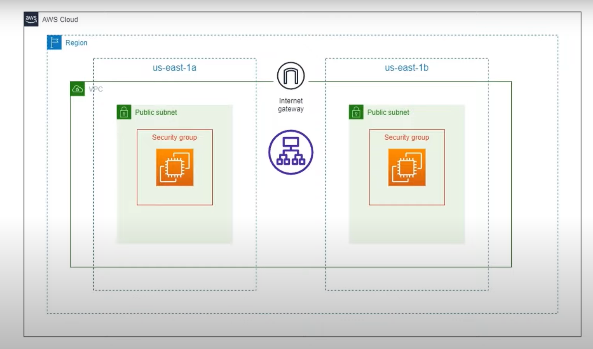

# Terraform VPC with GitHub Actions


## Overview


This repository contains Terraform configuration files for creating an AWS VPC with public subnets, an internet gateway, EC2 instances, security groups, and a load balancer. The infrastructure is provisioned using Terraform and automated through GitHub Actions for continuous integration and deployment (CI/CD).

## Features

- **Custom VPC**: Creates a custom VPC with specified CIDR blocks.
- **Public Subnets**: Provisions public subnets within the VPC.
- **Internet Gateway**: Connects the VPC to the internet.
- **EC2 Instances**: Launches EC2 instances within the public subnets.
- **Security Groups**: Configures security groups for the EC2 instances.
- **Load Balancer**: Deploys a load balancer to distribute traffic across EC2 instances.

## Prerequisites

- [Terraform](https://www.terraform.io/downloads.html) installed on your local machine.
- AWS account with sufficient permissions to create VPC, subnets, EC2 instances, and load balancers.
- GitHub account for accessing the repository and configuring GitHub Actions.

## Getting Started

### Clone the Repository

```bash
git clone https://github.com/adil6572/terraform-vpc-with-github-action.git
cd terraform-vpc-with-github-action
```

### Configure AWS Credentials

Ensure your AWS credentials are configured properly. You can use the AWS CLI to configure your credentials:

```bash
aws configure
```

### Initialize Terraform

Initialize the Terraform working directory and download necessary providers:

```bash
terraform init
```

### Plan and Apply

Review the Terraform plan and apply the configuration to provision the resources:

```bash
terraform plan
terraform apply
```

### GitHub Actions CI/CD

The repository includes a GitHub Actions workflow for automating the Terraform deployment. To enable this, ensure the following secrets are configured in your GitHub repository:

- `AWS_ACCESS_KEY_ID`
- `AWS_SECRET_ACCESS_KEY`

The workflow file is located at `.github/workflows/terraform-deploy`.

## Contributing

Contributions are welcome! Please open an issue or submit a pull request for any changes or improvements.

## License

This project is licensed under the MIT License. See the [LICENSE](LICENSE) file for details.
